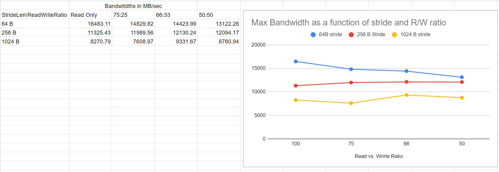

In part 2, we are supposed to measure maximum bandwidth of main memory with different access granularities and different read vs write intensity ratios.

for this, we can use the --max_bandwidth option of MLC tool.

Unfortunately, the MLC tool does not allow changing access granularities. It only allows us to change:

1) Buffer size (-b). The minimum amount of buffer size is 1 KiB. This option is primarily used to target between different levels of caches and RAM. At any rate, this option is useless since we are only concerned with main-memory here. We have to have a large value for Buffer Size so as to avoid caches.

2) Stride length (-l). This actually defines the address increment after every transaction. Default value is 64 B. Although this does not change the access granularity (amount of data per access), it changes the address granularity.

In our tests, we are changing the stride lengths nevertheless. Our buffer size is 100 megabytes per core.

The general format of the command is:

mlc.exe --max_bandwidth -l[stride_size_in_bytes]

The graphs of results are shown below

We can surmise that maximum bandwidth decreases with increase in stride size. It also decreases with decrease in read-to-write ratio.

Increase in stride size will increase read/write amplification, because the entire page will not be read. Moreover, since the page will change more often, the total Row Access Latency will increase, limiting our bandwidth.

Decrease in read-to-write ratio marginally decreases max bandwidth. This is because a write is essentially a read, but with minor row-buffer change overhead in RAM.

