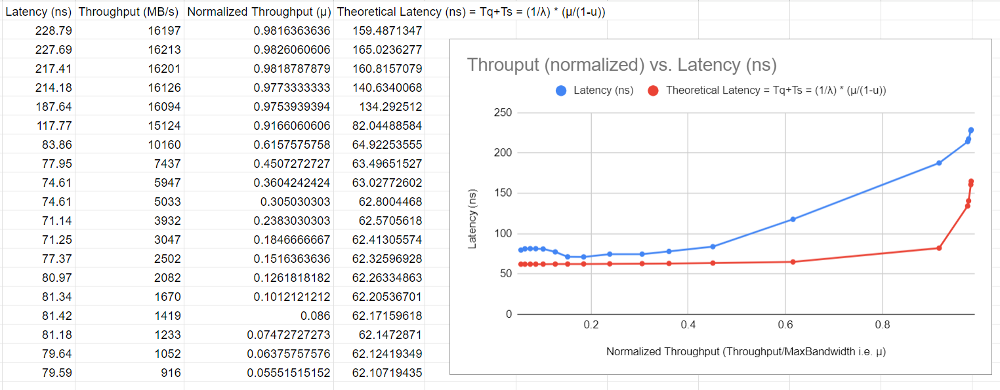

In part 3, we were supposed to explore the relationship between throughput and latency, and whether it conforms to the predictions of queuing theory.

We use the MLC tool's --loaded_latency option to calculate bandwidths at different latencies.

The MLC controls queue length (and hence latency) by inserting delays so as to throttle the memory-servers utilization. This results in different throughput at different latencies.

The command used was:

./mlc --loaded_latency -e -r

where,
-e tells MLC not to change prefetcher's settings
-r accounts for random memory access patern

 We plotted the resulting information after normalizing the bandwidth to its maximum, which essentially equals to server utilization (µ) from queueing theory* 

 The graph is given below

  

 The graph describes latency as a function of normalized-throughput. We also plotted the theoretical latency along with measured latency. The theoretical latency can be calculated as follows from queuing theory:

 $Lq = \(µ^2\)/\(1-µ\)$

 $Tq = Lq.Τ_server + µ.Τ_server$

 $Tq = \(µ^2\)/\(1-µ\).Τ_server + µ.Τ_server$

 $Tq = Τ_server.\(µ^2 + µ.\(1-µ\)\)/\(1-µ\)$

 $Tq = Τ_server*\(µ/\(1-µ\)\)$

 Latency = Tq+Τ_server = Τ_server*(µ/(1-µ)) + Τ_server

 We know $Τ_server$ to be the server latency, it is the latency when queue-length is 0. We calculated it in part 1. It was around 62 ns.

 *We know that,

 µ = λ.Τ_server

 λ = Arrival Rate = Departure Rate = Throughput

 Τ_server = Avg. Service Time or Server Latency

 1/Τ_server = B = Average Service Rate (when µ = 1); we know this from part 2 when we extracted max bandwidth

 So,

 µ = λ/B = Throughput/Max Bandwidth = Server Utilization = Fraction of bandwidth consumed