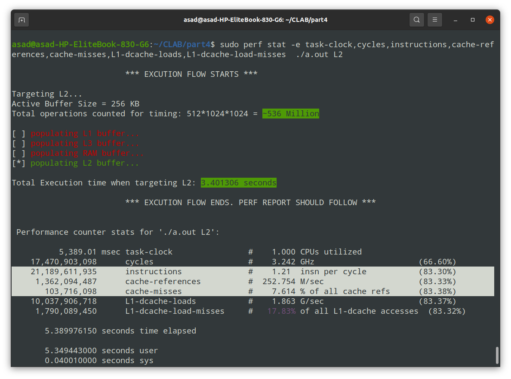

In part 4, we were supposed to measure the impact of cache miss on software performance. To do that, out plan was to perform 4 exactly same mathematical operations but on different buffer sizes. The buffer sizes were chosen to match the sizes of L1, L2, L3 cache. For RAM, a 128 MB buffer was used.

The main calculation part of the C code is the `selfVectorProduct` function. It iteratively reads two 32-bit elements from the input buffer, multiplies them, adns saves their sum to an accumulator.

In order to maximize the probablility of cache-misses for large buffer sizes, the buffers are accessed in a random order. That way, the memory access pattern has very poor locality of reference.

This random access is ensured by performing dependent loads, that is, the address of every next read is the value at the last address. In C notation: `value[i] == &value[i+1]`. This hinders the CPU pre-fetcher's pre-emption of the next load address, and every next address to be accessed has a high chance to be spatially very far away.

The program takes command line arguments for buffer sizes. Buffer sizes of 32KB, 256KB, 6MB and 128MB are used for L1-D cache, L2 cache, L3 cache and the RAM respectively.

The number of operations performed on these buffers of different sizes are exactly same, and are around 536 Million. We ensure this because we don't want any cache miss statistics reported that depend on factors other than memory heirarchy. The `perf stat` command verifies this at the runtime, as the number of instructions executed is very similar for all buffer sizes.

The results are shown in figures below. The program prints the time taken for execution. Higher execution time for higher buffer sizes corresponds to greater cache miss ratio, because cache misses incur a cost of latency in accessing the lower levels and updating the cache contents. Moreover, the `perf` command reports the **unified L3 cache miss rate**, and the **L1-D cache miss rate** as well.

Results for a buffer size of 32 KB. Targets L1-D cache primarily. In this case, the metric of concern is `L1-dcache-load-misses` at `perf` output.

Results for a buffer size of 256 KB. Targets L2 cache primarily.

Results for a buffer size of 6 MB. Targets L3 cache primarily. Note the increase in execution time.

Results for a buffer size of 128 MB. Targets the off-chip RAM primarily. The execution time increases very significantly because the cost of off-chip access is quite high.

