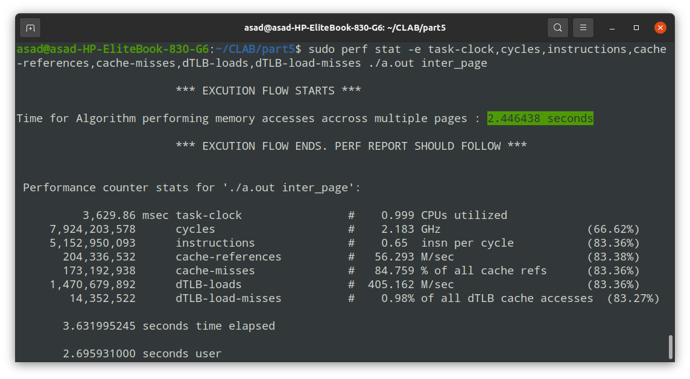
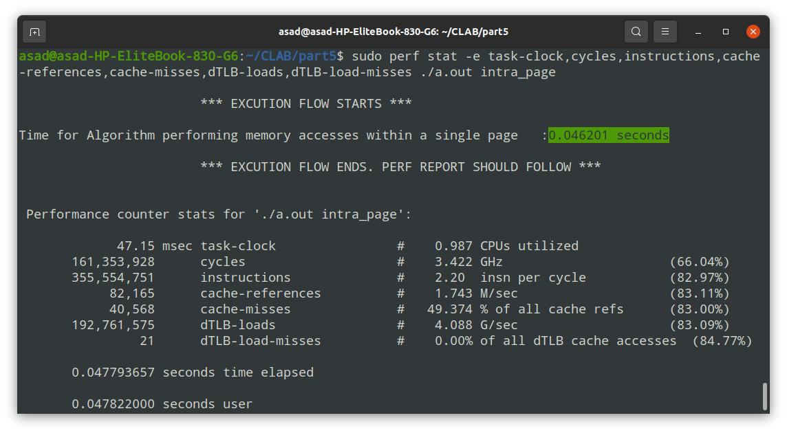

<h1>Part 5</h1>
In part 5, we were supposed to see the impact of misses in the Translation Lookaside Buffer. The TLB is usually a fully assosiative cache like structure inside the CPU used for quick virtual to physical address translation. A TLB miss usually results in a relatively expensive page walk. There can be a multi-level cache-like hierarchy for the TLB inside the processor as well.

For this part, we use the Linux's `mmap` system call to allocate pages to us. This way, we are sure that the memory allocated to our program always begins at a fresh page.

We then implement two cases:

1) **Intra-page access case**: In this case, the access pattern is contained within a few pages. We allocate 576 contiguous pages and perform calculations on random addresses from these pages. Each page is 4096 bytes long. But since we use an unsigned integer of 32-bit to perform calculations, our access granularity is 32-bits. This means we have 576x1024 addresses to choose from for our calculations.

2) **Inter-page access case**: In this case, every new access is in a new page. We allocate 576x1024 pages and perform calculations on the **first** addresses of any random page. Again, we have 576*1024 addresses to choose from for our calculations. Since the number of pages is much higher in this case, we expect to have a higher TLB miss ratio here.

Again, for the sake of a just comparison, the total number of arithmatic operations performed is kept the same, i.e., 12.28 million ops.

We use the `dTLB-loads` and `dTLB-load-misses` stats from the `perf` command for our results, and time the execution as well.

<h2>Results</h2>

