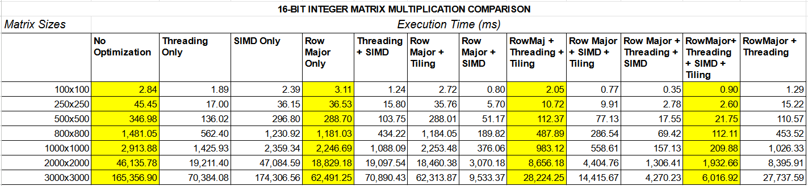
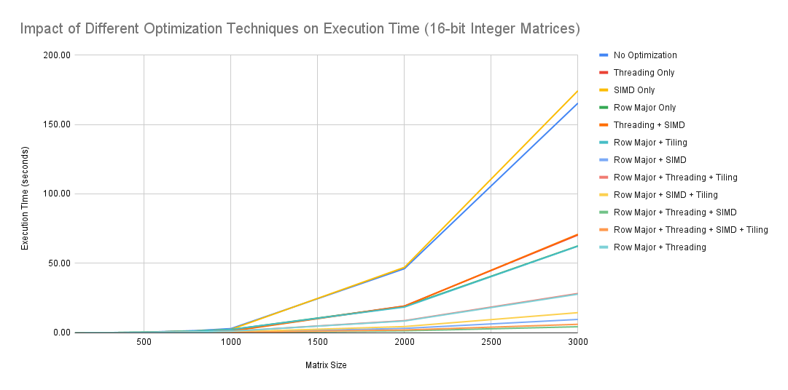
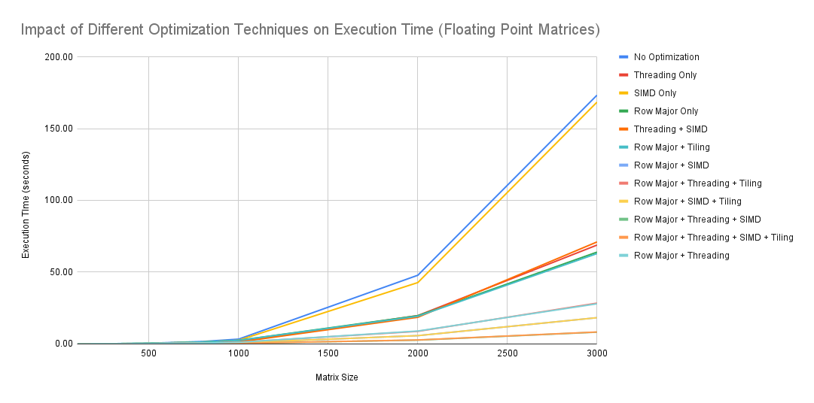

<h1>Project 2</h1>

Project 2 is intended to demonstrate the impact of memory access paterns, instruction-level parallelism and thread-level parallelism on task execution. In this project, we demonstrate various methods to accelerate matrix-matrix multiplication, and compare the results.

<h2>Code Organization</h2>

keywords: `function pointers`, `common execution interface`, `aligned memory mapping`, `dynamic allocation`, `CSV output`

 

<h2>Optimizations Used</h2>

keywords: `Column Wise Matrix Storage`, `Matrix Tiling`, `Multi Threading`, `linearized 2-D array storage`, `SIMD`, `atomicity`

<h2>Results & Analyses</h2>

The compiled results for various matrix sizes and optimization techniques are given below.
 

<h3>Results for 2-Byte fixed-point data-type matrices</h3>

_Table of execution time of various optimization texhniques under different matrix sizes_:

_Comparison of execution time in seconds for various optimization techniques_:

We can surmise from the above table and graph that the optimization techniques have the intended effect of accelerating the matrix-matrix product. However, some more salient comparisons are as follows:

- Arguably the most important optimization seems to be the **Row-Major representation of Matrix 2**, i.e. storing the Matrix 2 in a column-wise or transposed fashion. This allows for increased **spatial-locality** and helps in **pre-fetching** by the CPU. Only representing Matrix 2 column-wise slashes the execution time down to 33%.

- For naive matrix storage/data access, **SIMD** alone is not much beneficial for reducing execution time. This is probably because the data-access overhead is significantly larger than the actual computation time. This means that the naive implementation is **memory-bound**.

- If, through judicious re-arrangement (storing Matrix 2 column wise) and/or smart access pattern (tiling), we increase the actual data-access bandwidth for CPU, we starkly begin to see the advantages of using **SIMD**.
For instance, for a matrix-matrix product of 3000x3000, the naive implementation and the SIMD-only implementation both almost take 170 seconds. However, once we represent the matrix 2 column-wise in the memory, using **SIMD** slashes down the execution time for 60 seconds to 18 seconds, i.e. **30%** of the original. This means, that once we use the row-major representation (or tiling), our application becomes **compute-bound**.

- If the Matrix 2 is already transposed, **tiling** does not have much benefit, since locality exploitation is already almost perfect.

- 4 threads were used when using multi-threading. However, the perfect theoretical speedup of **4x** was not seen. The observed speedup is around **2.3x** in almost all cases. Due to the highly parallelizable nature of matrix-matrix multiplication, and almost no concern for atomicity in the implemented algorithm, this result does not concur with the **Amdahl's Law** of parallelization. The only reason seems to be memory-access contention: different cores could be evicting cache-enteries being used by each other, resulting in the application becoming more memory-bound.

- The best combination of optimizations seems to be "Row Major + Threading + SIMD", it usually brings the execution time to only **2.5% of the original**.

<h3>Results for 4-Byte floating-point data-type matrices</h3>

_Table of execution time of various optimization texhniques under different matrix sizes_:

_Comparison of execution time in seconds for various optimization techniques_:

From the above results we can see that

- All the observations for 2-byte integer case also hold for the 4-byte floating point case.
- This leads us to believe that, although floating point multiplications are computationally more complex, the **internal processor pipelining** allows it to maintain throughput similar to the integer multiplication case, even when using SIMD instructions. The advantage of internal pipelining is visible in cases with low instuction inter-dependency, like matrix-matrix product.

<h2>Conclusion</h2>

From this project, we conclude the following salient lessons:

- When optimizing a task, we must first identify the bottle-neck in the execution. Failing to resolve the bottle-neck may cause other unrelated optimizations to not bear any effect in speeding up the execution.
- Conversely, resolving bottle-necks in order of their significance can give us iteratively better implementations.
- When parallelizing an implementation, one must be careful about the atomicity of access. If the parallel parts of the program share data, mutexes and semaphores must be used to avoid race conditions.
- In order to reap the benefits of instruction-level parallelism, it is important that the application not be memory-bound. Therefore, the program should be structured to keep the processor occupied by providing hight memory-access throughput.