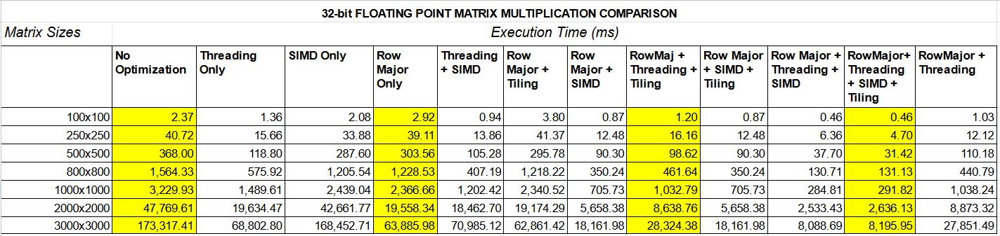

<h1>Project 2</h1>

Project 2 is intended to demonstrate the impact of memory access paterns, instruction-level parallelism and thread-level parallelism on task execution. In this project, we demonstrate various methods to accelerate matrix-matrix multiplication, compare the results, and comment on how these results can be explained.

The machine used for the following experiments is based on an 8-th Generation Intel laptop processor. It has 6 MBs of unified LL-cache, 4 cores, support for `AVX2`.

<h2>Code Organization</h2>

keywords: `function pointers`, `common execution interface`, `aligned memory mapping`, `dynamic allocation`, `CSV output`

The code is organized into multiple files for modularity. Since we have to use various types of matrix multiplications, we use function pointers as a means of templating, this allows us to dynamically change the function to be called on the basis of matrix multiplication and optimization required. This allows for code reusability, and a common execution interface for various optimization/data types.

The common arguments to various parts of code are passed through global structs like `execution_mode` and `mat_info`.
<br>
The execution flow of the program is shown below (Matrix initialization not shown)

```
Main -> Thread Scheduler (num_cores) -> Tiling Agent (tile_dimensions) --> Matrix Tile Multiplier (Naive, Short/Float)
                                                                       |-> Matrix Tile Multiplier (Transposed, Short/Float)
                                                                       |-> Matrix Tile Multiplier (AVX, Short/Float)
                                                                       |-> Matrix Tile Multiplier (Transposed, AVX, Short/Float)
```
In order to efficiently utilize `AVX 2`, the we use `mmap` instead of `malloc` to allocate multiple pages to our program. Memory mapped through `mmap` is always page-aligned. This has the added advantage of guarding against unaligned accesses (accesses on the edge of cache-line or `AVX` read granularity), which should give us better performance.

All the matrices are dynamically allocated and initialized. This means that the 2-D arrays are manually organized. We exploit this excess of control by saving matrix rows (or sometimes, columns) in a contiguous, 1-D fashion. This helps with drastically increasing **spatial locality** and **pre-fetching** potential.

The program outputs all results in a file in **CSV format**. This allows for ease of visualization and result data analyses. 
<br>
The program is compiled using the following command:
<br>

`gcc short_mat_init.c float_mat_init.c short_mat_funcs.c float_mat_funcs.c tiling_agents.c main.c -mavx2 -o a.out`

<h2>Optimizations Used</h2>

keywords: `Column Wise Matrix Storage`, `Matrix Tiling`, `Multi Threading`, `linearized 2-D array storage`, `SIMD`, `atomicity`

Following are the optimizations used to accelerate matrix-matrix product.

1. **Row Major Matrix 2 (Column Wise Storage of Matrix 2)**: In matrix multiplication, to get a single result, the first matrix is accessed row-wise, while the second matrix is column-wise. If we naively store the second matrix row-wise, this bears very poorly on spatial locality, as elements accessed in sequence are very far apart in the memory, and incur extra cache-miss cost. <br>So transposing the Matrix vastly improves **spatial locality**. It is in fact the most important optimization, as it resolves the original memory access bottle-neck, as will be seen in the results. 

2. **Tiling**: As taught in the class, tiling is used to improve **temporal latency**, that is, increasing the reuse of data within the cache for future calculations. In tiling, we divide the matrices into several, cache-fittable tiles.
<br>It was noted that tiling, though useful independently, is not much beneficial if matrix 2 is already stored in row-major form, since the memory bottle-neck due to locality issues is already resolved.
<br> Tiling size of `64x64` was found to be most efficient by experimentation.

3. **SIMD**: `AVX2` was used as SIMD optimization. `AVX2` improves **instruction-level** parallelism. The generic C code to be implemented was:
<br>

`temp += fmat1[row_idx][i] * fmat2[i][col_idx];`

Our `AVX 2` implementation for `floats` was:

```
prod_vec  = _mm256_dp_ps(row_vec, col_vec, 0xF1);
accum_vec = _mm256_add_ps(accum_vec, prod_vec);
```

Our `AVX 2` implementation for `shorts` was:

```
prod_vec = _mm256_madd_epi16(row_vec, col_vec);
accum_vec = _mm256_add_epi32(accum_vec, prod_vec);
```

Some peripheral `AVX` code was also used in an ancilliary role.

4. **Multi-threading**: POSIX threads were used for multi-threading. Multi-threading improves **thread-level parallelism**. Threads were created along chucks of rows of matrix 1, which were then allocated to the tile-processor independently. A total of 4 parallel threads were used.


<h2>Results & Analyses</h2>

The compiled results for various matrix sizes and optimization techniques are given below.
<br>

<h3>Results for 2-Byte fixed-point data-type matrices</h3>

_Table of execution time of various optimization texhniques under different matrix sizes_:


_Comparison of execution time in seconds for various optimization techniques_:


We can surmise from the above table and graph that the optimization techniques have the intended effect of accelerating the matrix-matrix product. However, some more salient comparisons are as follows:

- Arguably the most important optimization seems to be the **Row-Major representation of Matrix 2**, i.e. storing the Matrix 2 in a column-wise or transposed fashion. This allows for increased **spatial-locality** and helps in **pre-fetching** by the CPU. Only representing Matrix 2 column-wise slashes the execution time down to 33%.

- For naive matrix storage/data access, **SIMD** alone is not much beneficial for reducing execution time. This is probably because the data-access overhead is significantly larger than the actual computation time. This means that the naive implementation is **memory-bound**.

- If, through judicious re-arrangement (storing Matrix 2 column wise) and/or smart access pattern (tiling), we increase the actual data-access bandwidth for CPU, we starkly begin to see the advantages of using **SIMD**.
For instance, for a matrix-matrix product of 3000x3000, the naive implementation and the SIMD-only implementation both almost take 170 seconds. However, once we represent the matrix 2 column-wise in the memory, using **SIMD** slashes down the execution time for 60 seconds to 18 seconds, i.e. **30%** of the original. This means, that once we use the row-major representation (or tiling), our application becomes **compute-bound**.

- If the Matrix 2 is already transposed, **tiling** does not have much benefit, since locality exploitation is already almost perfect.

- 4 threads were used when using multi-threading. However, the perfect theoretical speedup of **4x** was not seen. The observed speedup is around **2.3x** in almost all cases. Due to the highly parallelizable nature of matrix-matrix multiplication, and almost no concern for atomicity in the implemented algorithm, this result does not concur with the **Amdahl's Law** of parallelization. The only reason seems to be memory-access contention: different cores could be evicting cache-enteries being used by each other, resulting in the application becoming more memory-bound.

- The best combination of optimizations seems to be "Row Major + Threading + SIMD", it usually brings the execution time to only **2.5% of the original**.

<h3>Results for 4-Byte floating-point data-type matrices</h3>

_Table of execution time of various optimization texhniques under different matrix sizes_:


_Comparison of execution time in seconds for various optimization techniques_:


From the above results we can see that

- All the observations for 2-byte integer case also hold for the 4-byte floating point case.
- This leads us to believe that, although floating point multiplications are computationally more complex, the **internal processor pipelining** allows it to maintain throughput similar to the integer multiplication case, even when using SIMD instructions. The advantage of internal pipelining is visible in cases with low instuction inter-dependency, like matrix-matrix product.

<h3>The case of 10000x10000 matrix</h3>

10000x10000 matrix-matrix product is very expensive in time. Nevertheless, one such execution was done with `SIMD`, `tiling`, `multi-threading` and `row-major matrix 2 form` optimizations enabled.

It took `240,412` milliseconds. In contrast a 1000x1000 matrix product with same optimizations took `209` milliseconds. The time cost ratio is **1150:1**, which is close to the theoretical **1000:1**, since matrix product is an `O(3)` operation, i.e., increasing the elements by `N` increases time complexity by `N^3`.
 
<h2>Conclusion</h2>

From this project, we conclude the following salient lessons:

- When optimizing a task, we must first identify the bottle-neck in the execution. Failing to resolve the bottle-neck may cause other unrelated optimizations to not bear any effect in speeding up the execution.
- Conversely, resolving bottle-necks in order of their significance can give us iteratively better implementations.
- Moreover, multiple optimizations targetting same bottleneck may not result in better performance, because the bottleneck might have shifted elsewhere (e.g. from memory to compute).
- When parallelizing an implementation, one must be careful about the atomicity of access. If the parallel parts of the program share data, mutexes and semaphores must be used to avoid race conditions.
- In order to reap the benefits of instruction-level parallelism, it is important that the application not be memory-bound. Therefore, the program should be structured to keep the processor occupied by providing high memory-access throughput.