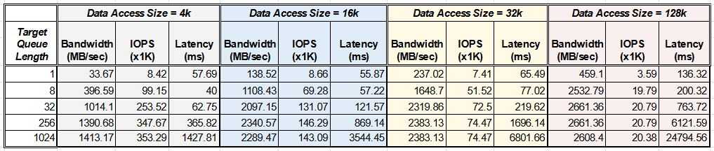

<h1>Project 3</h1>

Project 3 is intended to explore the behavior and capabilites of non-volatile storage devices. In this project we use the **fio** utility on Ubuntu, and try to acquire stats like **bandwidth**, **IOPS** and **latency** under work-loads with with varying **data access sizes**, **target queue lengths** and **read/write ratios**.


<h2>1. Experimental Setup</h2>

keywords: `fio jobs`, `read-write load simulation`, `python scripts`, `JSON output`, `Queue length equivalence`

<h4>SSD under test:</h4>
Toshiba KXG60ZNV256G - 256 GB NVMe SSD.<br>
512 MB seperate drive created for all fio experiments.

<h4>fio job description file:</h4>
The **fio** command-line utility can take a job description file as input. The job description file contains the details of the IO job to be carried out. Contents of a sample job description file are given below:
```
; -- start job file --
[job1]
ioengine=libaio             ; use the standard linux async IO library
iodepth=32                  ; Target queue depth to be maintained. Impacts bandwidth. 
bs=4k                       ; Block size of is the unit of IO to be read or written, i.e., the data access size.
numjobs=1                   ; !! Misleading. Number of identical processes to be spawned for each job.  
direct=1					; Avoid kernel caching for disk IOs.
fsync=0                     ; Do not issue fsync after every access. Setting it to 1 drastically diminishes IOPS and BW.
filename=/dev/nvme0n1p5     ; Name of the target drive for test
rw=randwrite                ; Type of access pattern. Can be randwrite, randread, randrw and all their sequential counter parts
size=512m                   ; Size of the test reqion. Number of IOs = size/bs.
; -- end job file --
```

Job description files like these were used with some changes to meet the needs of all stipulated testing scenarios. An example command which uses the job description file `jobfile.fio` is given below.

<h4>Command Format:</h4>
```bash
sudo fio --output=../output_files/outfile.json --output-format=json --bs=4k --iodepth=8 jobfile.fio
```

<h3>Stats Collection Overview</h3>

The assignment calls for measuring the stats for various **data access sizes**, **target queue lengths** and **read/write ratios**. However, the **fio** utility is not very flexible with different read-write ratios. The only random read/write ratio options available out of the box are `0:100`, `50:50` and `100:0`. To achieve stats for read-write ratio of `75:25`, we run 4 parallel jobs, 1 for writes and 3 for reads. A job description file specifying 4 parallel jobs is as follows:

```
[global]                    ; Common params for all jobs
ioengine=libaio
numjobs=1
direct=1
fsync=0
filename=/dev/nvme0n1p5

[j1]                        ; Job 1. Performs parallel random reads.
rw=randread
size=128m                   ; Assigned read/write space. 512MB/4 = 128MB.

[j2]                        ; Job 2. Performs parallel random reads.
rw=randread
size=128m

[j3]                        ; Job 3. Performs parallel random reads.
rw=randread
size=128m

[j4]                        ; Job 4. Performs parallel random writes.
rw=randwrite
size=128m
```

In order to efficiently gather stats for all the required cases of **read-write ratios**, **queue lengths** and **access sizes**, we perfome the steps given below. These steps are automated via a few python scripts.

1. Create jobs with various read-write loads. Done by `jobfile_maker.py`
2. Iteratively call `fio` command-line utility for all the required **read-write ratios**, **queue lengths** and **access sizes**. This is done by `command_iterator.py`. **fio**'s default output is in human-readable text format, which - while easy to read -  can be quite cumbersome to manually extract information from. Fortunately, **fio** can also emit the results in `JSON` format which can be easily parsed to get required information.
3. Process the `JSON` output files to extract **bandwidth**, **IOPS** and **latency** for the above parameters. Done by `json_processor.py`.

The format bash of command executed in `command_iterator.py` is given below. This one perfomrs read-only test with IO blocks of 4 KiB and target queue length of 16:<br>
```bash
sudo fio --output=outfile_blk4k_qlen16_rw100_0.json --output-format=json --bs=4k --iodepth=16 JobFiles/jobfile_RW_100_0.fio
```

<h2>Results & Analyses</h2>

This section summarizes with the results of the **fio** experiments extracted via `json_processor.py`.

<h3> R/W Ratio of 100:0</h3>

**R/W ratio: 100:0**
====================

_Table of statistics for read-vs-write ratio of 100:0_:


- script output screenshots
- Comments

<h3> R/W Ratio of 50:50</h3>

**R/W ratio: 50:50**
====================

_Table of statistics for read-vs-write ratio of 50:50_:


- script output screenshots
- Comments

<h3> R/W Ratio of 75:25</h3>

**R/W ratio: 75:25**
====================

_Table of statistics for read-vs-write ratio of 75:25_:


- script output screenshots
- Comments

<h3> R/W Ratio of 0:100</h3>

**R/W ratio: 0:100**
====================

_Table of statistics for read-vs-write ratio of 0:100_:


- script output screenshots
- Comments

Prelim conclusion and analysis

Increasing queue length increases server utilization $µ$, which makes higher bandwidth possible

1. Graph for one case: (queue length and BW on x-axis, Latency on y-axis)

2. Graph for one case: (IOPS, Blocksize and Bandwidth)

_Table of execution time of various optimization texhniques under different matrix sizes_:


_Comparison of execution time in seconds for various optimization techniques_:


<h2>Conclusion</h2>

keywords: `NVMe device`, `comparison with intel (targets very low latency)`, `BW/lat relation seen`, `When to use IOPS`

- When optimizing a task, we must first identify the bottle-neck in the execution. Failing to resolve the bottle-neck may cause other unrelated optimizations to not bear any effect in speeding up the execution.
- Conversely, resolving bottle-necks in order of their significance can give us iteratively better implementations.
- Moreover, multiple optimizations targetting same bottleneck may not result in better performance, because the bottleneck might have shifted elsewhere (e.g. from memory to compute).
- When parallelizing an implementation, one must be careful about the atomicity of access. If the parallel parts of the program share data, mutexes and semaphores must be used to avoid race conditions.
- In order to reap the benefits of instruction-level parallelism, it is important that the application not be memory-bound. Therefore, the program should be structured to keep the processor occupied by providing high memory-access throughput.
