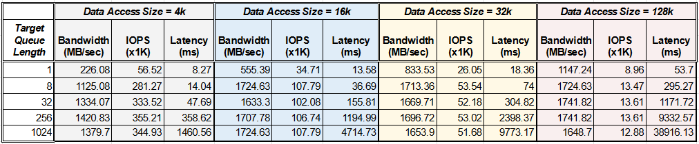
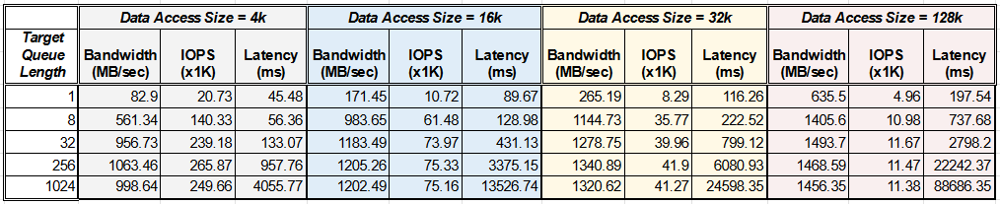

<h1>Project 3</h1>

Project 3 is intended to explore the behavior and capabilites of non-volatile storage devices. In this project we use the **fio** utility on Ubuntu, and try to acquire stats like **bandwidth**, **IOPS** and **latency** under work-loads with with varying **data access sizes**, **target queue lengths** and **read/write ratios**.


<h2>1. Experimental Setup</h2>

keywords: `fio jobs`, `read-write load simulation`, `python scripts`, `JSON output`, `Queue length equivalence`

<h4>SSD under test:</h4>
Toshiba KXG60ZNV256G - 256 GB NVMe SSD.<br>
512 MB seperate drive created for all fio experiments.

<h4>fio job description file:</h4>

The **fio** command-line utility can take a job description file as input. The job description file contains the details of the IO job to be carried out. Contents of a sample job description file are given below:

```
; -- start job file --
[job1]
ioengine=libaio             ; use the standard linux async IO library
iodepth=32                  ; Target queue depth to be maintained. Impacts bandwidth. 
bs=4k                       ; Block size of is the unit of IO to be read or written, i.e., the data access size.
numjobs=1                   ; !! Misleading. Number of identical processes to be spawned for each job.  
direct=1					; Avoid kernel caching for disk IOs.
fsync=0                     ; Do not issue fsync after every access. Setting it to 1 drastically diminishes IOPS and BW.
filename=/dev/nvme0n1p5     ; Name of the target drive for test
rw=randwrite                ; Type of access pattern. Can be randwrite, randread, randrw and all their sequential counter parts
size=512m                   ; Size of the test reqion. Number of IOs = size/bs.
; -- end job file --
```

Job description files like these were used with some changes to meet the needs of all stipulated testing scenarios. An example command which uses the job description file `jobfile.fio` is given below.

<h4>Command Format:</h4>

```bash
sudo fio --output=../output_files/outfile.json --output-format=json --bs=4k --iodepth=8 jobfile.fio
```

<h3>Stats Collection Overview</h3>

The assignment calls for measuring the stats for various **data access sizes**, **target queue lengths** and **read/write ratios**. However, the **fio** utility is not very flexible with different read-write ratios. The only random read/write ratio options available out of the box are `0:100`, `50:50` and `100:0`. To achieve stats for read-write ratio of `75:25`, we run 4 parallel jobs, 1 for writes and 3 for reads. A job description file specifying 4 parallel jobs is as follows:

```
[global]                    ; Common params for all jobs
ioengine=libaio
numjobs=1
direct=1
fsync=0
filename=/dev/nvme0n1p5

[j1]                        ; Job 1. Performs parallel random reads.
rw=randread
size=128m                   ; Assigned read/write space. 512MB/4 = 128MB.

[j2]                        ; Job 2. Performs parallel random reads.
rw=randread
size=128m

[j3]                        ; Job 3. Performs parallel random reads.
rw=randread
size=128m

[j4]                        ; Job 4. Performs parallel random writes.
rw=randwrite
size=128m
```

In order to efficiently gather stats for all the required cases of **read-write ratios**, **queue lengths** and **access sizes**, we perfome the steps given below. These steps are automated via a few python scripts.

1. Create jobs with various read-write loads. Done by `jobfile_maker.py`
2. Iteratively call `fio` command-line utility for all the required **read-write ratios**, **queue lengths** and **access sizes**. This is done by `command_iterator.py`. **fio**'s default output is in human-readable text format, which - while easy to read -  can be quite cumbersome to manually extract information from. Fortunately, **fio** can also emit the results in `JSON` format which can be easily parsed to get required information.
3. Process the `JSON` output files to extract **bandwidth**, **IOPS** and **latency** for the above parameters. THis is done by `json_processor.py`.

The format bash of command executed in `command_iterator.py` is given below. This one perfomrs read-only test with IO blocks of 4 KiB and target queue length of 16:<br>
```bash
sudo fio --output=outfile_blk4k_qlen16_rw100_0.json --output-format=json --bs=4k --iodepth=16 JobFiles/jobfile_RW_100_0.fio
```

<h2>Results & Analyses</h2>

This section summarizes with the results of the **fio** experiments extracted via `json_processor.py`. The results are categorized according to read-write ratios.

<h3> Case I: Results for R/W Ratio of 100:0</h3>

_Table of statistics for read-vs-write ratio of 100:0_


- The relationship between IOPS and throughput (called bandwidth in context of **fio**) agrees with the theory, i.e., $Bandwidth = IOPS * SizeOfDataAccess$.
- [*] Increase in queue length corresponds with increase in bandwidth (and also IOPS) along with latency. This is in line with the queuing theory: Higher queue length means better server utilization, which allows the queue server to achieve a higher fraction of maximum bandwidth. However, it also increases latency due to queue width $T_q$.
- Larger data access sizes result in higher bandwidth, however the increase in bandwidth is usually not proportional to the increase in data access size. This is because larger data access sizes put a strain on the interconnect, as there is more data to be moved around. So in this case, the interconnect bandwidth at the junction of the NVMe interface, and the device, becomes the bottleneck.<br> To illustrate, if we have infinite interconnect or external bandwidth, doubling data access size should double bandwidth because the IOPS would remain the same (up until the access size is less than NAND page size). But in the case of limited external bandwidth, IOPS actually go down with increase in data access size, which results in a less-than-proportional increase in the bandwidth.

<h3> Case II: Results for R/W Ratio of 0:100</h3>

_Table of statistics for read-vs-write ratio of 0:100_


- As opposed to the case of 100% reads, the case of 100% writes is surprisingly faster for lower queue sizes and lower data access sizes. This seemed an odd result at first, but I have verified it against online benchmarks [Link text](https://ssd.userbenchmark.com/SpeedTest/358656/KXG50ZNV256G-NVMe-TOSHIBA-256GB).<br>There is a good explanation for this behavior, though. We know that, at the level of a NAND flash die, the write operation is very expensive: all writes must erase a whole block and re-write it again. However, to cirvumvent this issue, SSDs usually have large write buffers, which accumulate writes before flushing. And since a write is only uni-directional from the perspective of the rest of the system, write-bandwidth can actually appear faster than read-bandwidth for small access sizes. For larger access sizes, the read-bandwidth starts to win again, since the afore-mentioned write buffer gets filled more often.
- All the other observations are along the lines of Case I.

<h3> Case III: Results for R/W Ratio of 50:50</h3>

_Table of statistics for read-vs-write ratio of 50:50_


- The case of 50% random reads and 50% random writes performs poorly for larger queue sizes. From the online benchmarks, this also seems like an expected behavior (deep queue mixed read/writes are show lower throughput than only reads and only writes). But I have no good guesses as to why. I can only speculate that this is because of some finer internal detail of the flash controller architecture. Mixed read writes with large queues may cause excessive mode switching inside the SSD, which the SSD controller might not be very good at.

- For short queue sizes, this case has similar bandwidth numbers for the write only case. 
- All other observations from Case I still apply.

<h3> Case IV: Results for R/W Ratio of 75:25</h3>

_Table of statistics for read-vs-write ratio of 75:25_


- For the deep queue sizes (256, 1024), this case is almost similar to the Case III. For shorter queues, this case tends towards a read-only like behavior.

<h2>Observations</h2>

From the above experiments and there results, we can make a few salient observations:

1. Increasing queue length increases server utilization $µ$, which makes higher throughput possible. So the relationship between throughput and latency is also seen here. The two graphs below illustrate this.

 vs Latency(ms).png)

.png)


2. For smaller data access sizes, increasing queue length tends to increase IOPS (at least for some steps). But for larger data access sizes, IOPS do not change much with the queue length. This is explainable, since larger data access sizes tend to saturate the external bandwidth pretty quickly, limiting the IOPS to the external bandwidth.<br> This explains why IOPS are used by SSD vendors to demonstrate throughput for small data access sizes: It shows how fast the internal NAND architecture can be in the best of cases. However, since the external bandwidth becomes the limiting factor for bigger data access sizes, it is practical to report the maximum possible data transfer rate in MB/sec for large data access sizes.

This relationship is explored in the following graph which plots queue length against IOPS (for the case of 100% writes). As can be seen, IOPS stay constant across multiple queue lengths for the data access size of 128K, pointing to a transfer bandwidth saturation. 

.png)

<h2>Conclusion</h2>
From this project, the trade-off between throughput and latency is reinforced again. We also see the significance of data-access size and queue-length in SSD performance, and the reasons why they could influence throughput. We also see that, although the individual physical read/write operations are very slow inside an SSD, the practice of parallelising elements inside an SSD allows for such high theoretical bandwidths that it may even be limited by the external bandwidth.

<h3>Why Intel D7-P5600 has 130k IOPS for random write-only 4KB case</h3>

Since we could not find the exact queue depth for these tests, we assume QD32 or greater for comparison. In that case, our SSD demonstrates around 360K IOPS for random 4KB writes, that is, almost 3 times faster that P5600. Our SSD could beat the $7000 industrial grade SSD for 4KB random writes for the following reasons:

1. The P5600 rarely has to deal with data access sizes of 4KB, that is why it is not optimized for small data access sizes.
2. For higher reliability, the industrial SSD might use more aggressive error correction coding and fault-handling techniques. This may be the reason for low write IOPS.