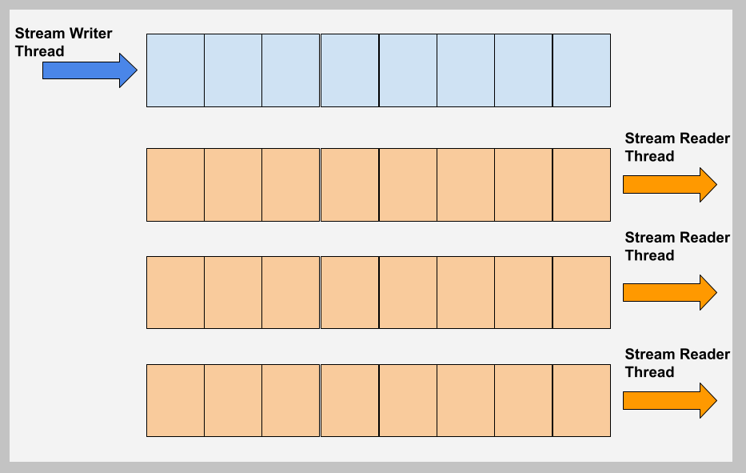
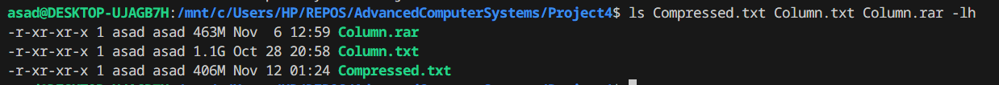

<h1>Project 4</h1>

Project 4 is the implementation of dictionary codec, that enables operations like compression and fast look-up/scan on a column of data with low cardinality.<br>

We implement an N-ary tree to aid encoding and search/scan operations on the given column. We also implement integer compression techniques like delta and Huffman encoding to reduce SSD footprint.<br>

Due to some optimizations considering low-cardinality columns, our on-disk size of the compressed file is`405 MB`, which beats the **WinRAR's best compression option** of `475 MB` by ~15%. It also boasts two methods for search/scan, one for extremely low lookup latency, and the other for small main memory footprint.

The project also makes use of multi-threading and SIMD to speed up encoding and lookup operations respectively.

<h2>Design Strategies & Techniques Used</h2>

keywords: `N-ary tree`, `prefix`, `prototyping and analysis`, `Delta encoding`, `Huffman coding`


Considering that our target is to compress a low-cardinality column, with lots of elements that are either repeated or share a common prefix, a **tree-like** structure seems a natural choice. As opposed to hashes, trees have the added advantage of eliminating repetitions due to common prefix, and enabling natural prefix scans.<br>

For simplicity, we have used a data-structure that extends an N-ary tree. This data-structure can be used for encoding, element search, prefix scan, and can be modularly extended to enable writing of the compressed column to disk, or a separate data structure.<br>

<h3>Data Representation in the N-ary Tree</h3>

In our data structure, every word is stored character-wise in the tree nodes. Every node in the tree stores a character, and has a set of pointers pointing to the next character of the word.<br>
If the node is terminal (i.e., represents the last character in a string), it also stores a dynamic list of indices where the string appears in the uncompressed column. This way, repeating words are only represented once (with their different indices stored in a leaf node representing the last character). Words with common prefixes diverge at the first different character, and hence are also represented with as little repetition as possible.

To illustrate, words "carmen" and "carpet" would be represented with 9 nodes in total, with the common prefix "car" saved only once. The node representing "r" would have two pointers - to "m" and "p" - for the non-similar parts of the words.

This type of representation is especially amicable to the operation of prefix search, as will be seen later.

<h3>Integer Compression</h3>

For on-disk storage, we combined two integer compression techniques:

1. **Delta compression**: Except for the first element, each element $c_i$ in the compressed integer sequence is expressed as the difference of the elements $a_i$ and $a_{i-1}$ in the original list. The first element of both the compressed and the original list is the same. Delta compression works well when the jumps between integers of a sequence are smaller than their absolute values, which could further aid the quality of compression by huffman coding.

2. **Huffman coding**: The original sequence stores integers in 32-bit unsigned format. With Huffman encoding enabled, we use variable sizes of integers to store the sequence elements. The MSbits of every integer in the compressed sequence correspond to its size: if the MSbit is `0`, it's a 23-bit integer stored in 3 bytes; if the MSbit is `1` then it's a 14-bit integer stored in 2 bytes (if the 2nd MSbit is `0`), or a 30-bit integer stores in 4 bytes (if 2nd MSbit is `1`).<br> Huffman coding adds some complexity to the decoding process, but this alone results in a **25 %** reduction in the size of the integer sequence.

<h3>String Compression</h3>
Apart from integer compression, we also use a variant of delta coding for string compression of the on-disk compressed file. Here, every word is represented in terms of its difference from the previous word: only the different part of the later word is stored. A single character denoting the length of the difference is also stored in this technique.

To illustrate, let's say we save "carmen" and "carpet". In storage, they would look like: "carmen<3>pet", where <3> denotes that the last three characters of "carmen" have to be discarded, and the string "pet" has to be added to get the new word "carpet". This techniques is quite useful when we store the data in alphabetical order (which is naturally done if we traverse our tree in depth first order).<br>

To test the feasibility of our design decisions, a prototype was first implemented in `python`. The analysis of different compression techniques used is given in the following section.

<h2>Analysis of compression techniques</h2>
keywords: `Integer compression`, `string compression`, `delta coding for strings`, `on-disk compressed storage`

A preliminary analysis of the compression techniques for the given column file was performed. The results, aided by an implementation of the tree structure in `python`, are given below.

<h4>Column Details:</h4>

```
Total number of elements: 139999654 (~133.5 Mega Entries)
Unique elements: 975773 (~0.93 Mega Entries)
Unique-to-Total ratio: 0.7 % or ~1/140
Average entry size: 8 characters

Size before compression:
	1,120,173,090 bytes (~1,069 MB)
Best Theoretical size post compression (Repetition elimination only, assuming 4-byte ints):
	975773*8 + 139999654*4 = 567,804,800 bytes (~541 MB), i.e., 50% of the original.
```

<h4>Integer Compression details</h4>

We start with an uncompressed sequence of integers that represent indices of column elements. Originally, each integer occupies 4 bytes. After performing `Huffman & Delta encoding`, the integer sizes in the compressed sequence have following ratios:

```
Post-compression size ratios:
16-bit Ints: ~ 2.4%
24-bit Ints: ~ 97.3%
32-bit Ints: ~ 0.22%
```

This corresponds to an average of 2.975 bytes per integer in the compressed stream. This means all the integers in the compressed stream can be further compressed by 25%.

Experimentally we see:
```
Size of all indices before compression = 139999654 * 4 = 5599998616 Bytes = ~ 534 MB. 
Post-Huffman & delta encoding compressed size (Indices only): 419,808,734 bytes = 400.36 MB.
```

The post compression file size matches expectations, since 534 MB *3/4 = 400.5 MB.


<h4>Text Compression Details</h4>

```
Size estimate of unique text : (975773 uniques * 8 B average): ~ 7,806,184 bytes = ~ 7.44 MB
Size after string delta encoding: 6,267,526 bytes = ~5.97 MB
Delta Encoding Advantage: 6,267,526/7,806,184 = 80.2%
```

<h4>Total Post Compression Size</h4>

Post-Huffman & delta encoding compressed size (Full File): 426,076,260 bytes = ~406 MB

Which is $406 MB/1069 MB$ i.e. only $38\%$ % of the original file size.

<h3>Conclusion</h3>

As discussed, eliminating repetitions accounts for around 50% reduction. Compounding over that, integer compression can reduce the size by an additional **25%**. However, string delta compression only saves us around **1.5 MB**, which amounts to almost nothing in the grand scheme of things. So the in-memory size is around **534 MB**, and on-disk size is **406 MB**.

<h2>Code Overview</h2>
keywords: `tree node`, `fast lookup`, `multi-threading for encoding`, `multi-FIFO scheduler`, `mutex`, `SIMD support for lookup`

The code is split into multiple classes and files for modularity. It is primarily centered around a C++ class called `treenode`, which represents a single tree node. The class has methods like `addElement` and `lookup`.

<h3>Method Overview</h3>

The `addElement` method simply adds an element to the node, making a new node sequence if the element has not appeared before, or coalescing it with prior nodes if the element has appeared before. It naturally forks-off at the appropriate point if the element being added is unique, but shares a prefix (of any length) with prior elements.

The `lookup` method searches the tree for a given sequence of characters, and returns a node that represents the last character of the sequence. This returned node can then be used for both **prefix scan** and **single element search**. For **single element search**, we simply list the vector of indices stored in the returned node. For **prefix scan**, we recursively `traverse` the children of the returned node, and list the vector of indices, along with the post-fix, for any terminal nodes.

The `traverse` method can additionally be used to:
- **_(a)_** traverse the entire tree (or a subtree) and store the output in memory.
- **_(b)_** traverse the entire tree (or a subtree) and integer/string compress the results for on-disk storage.
- **_(c)_** store the entire tree (or a subtree) into another, less memory consuming data structure.

<h3>Multi-threading support for encoding</h3>

Supporting multi-threading for encoding is an interesting challenge. A naive approach would have us split the uncompressed stream of data in multiple units for parallel encoding. However, we also need the index of the element being added. If we split the streams, we can not know the index numbers of their elements unless we scan them. Scanning is a slow, sequential operation which then must be done on the entire file with one thread. This way, the time consumed in splitting the streams for parallelization could very well cause us to lose all the advantage of multi-threading.

Therefore, we use a **ping-pong** like, or a **multi-FIFO scheduling data-structure**, as shown below:


During the encode operation, we create multiple queues. At any given time, one of these queues is being filled by the main thread, while all the others are being read by multiple threads for encoding. Each queue has its own `mutex`. Every threads iterates over queue indices to **acquire** a `mutex lock`. If a thread fails to acquire the lock, it attempts the same on another queue. If a thread succeeds, it reads or writes to the FIFO, and unlocks the `mutex` before leaving. This method ensures almost perfect utilization of the available threads without fear of race conditions.

In addition to this, every node in a tree also supports a `mutex` for `atomicity` of access. This way, no two threads access a single node at once, and the shared data does not get corrupted.

The advantage of multi-threading will be shown in the results section.

<h3>SIMD support for search/scan</h3>

The tree itself is not amicable to SIMD implementation of lookup. However, the in memory compressed stream can be searched very quickly using SIMD instructions.

For search and scan operations we use SIMD instructions from AVX 2. The strategy here is to compare 4 strings of 8 characters at once with a given string. If any of the strings matches, we go on to perform a detailed scan and find the exact string that matched (or even if the match passes beyond 8 characters). To that end, a function called `compare_four_simd` was written which uses an AVX2 kernel for search acceleration.

The function is given below:

```C++
bool compare_four_simd(std::vector<std::string> &str_vec, std::string comp_str, int base_idx) {
	int match_mask;
	char retval = 0;

	// make a sortie of 4 strings of 8 character
	__m256i compare_sortie = _mm256_set_epi64x(
		*(long long *) &str_vec[base_idx+0][0],
		*(long long *) &str_vec[base_idx+1][0],
		*(long long *) &str_vec[base_idx+2][0],
		*(long long *) &str_vec[base_idx+3][0]
	);

	__m256i base_sortie = _mm256_broadcastq_epi64(*(__m128i *) &comp_str[0]);		// copy the 8 bytes to all 4 strings
	__m256i cmp_res = _mm256_cmpeq_epi8(compare_sortie, base_sortie);				// compare in parallel
	match_mask = _mm256_movemask_epi8(cmp_res);										// condense to bit info per character
	match_mask = (char) _mm256_movemask_epi8(*(__m256i *) &match_mask);				// condense to bit info per string

	// if any of the bits of the lowest byte are 1, we have a string match.
	return (match_mask != 0);
}
```

The results of `compare_four_simd` can then be scanned in detail if any of the string matches. The advantage of using SIMD will be shown in the following section.

<h2>Results</h2>

The following results were compiled on a machine based on an 8th generation intel processor with 4 cores and 8 threads. The machine has 8 GigaBytes of RAM.

<h3>I- Encoding performance under different number of threads</h3> 

The following table compares the encoding performance under different number of threads:


As can be observed, increasing the number of cores drastically reduces the total encoding time. A very minute amount of speed-up is lost due to `mutexes`, that block a thread if it accesses a node already under access by another thread. But the sheer number of nodes reduces the probability of this occurring very often.

The output of the program after encoding looks as follows:

_Encoding results on 4 threads:_


<h3>II- Single data item search</h3> 

To perform all these experiments, we randomly query a large number of elements, and consume their results without printing.

First, we need to establish a baseline:


So the baseline design takes an average of 111.2 milliseconds to perform a single query.

The program supports 2 flavors of item search:
1. Tree search.
2. Compressed sequence search.

The tree search has a time complexity of $O\(log\(N\)\)$, while the compressed sequence search has a complexity of $O(N)$.

The following snapshot shows the tree single item search and prefix scan results (Tree search does not support SIMD):


The following snapshot shows the compressed sequence single item search and prefix scan results (with and without SIMD):


Following is a chart of comparisons that summarizes these results.


<h3>III- Prefix scan</h3> 

As with search, this program supports 2 flavors of prefix scan:
1. Tree search.
2. Compressed sequence search.

Search and prefix scan times are similar, because **_(a)_** for the tree structure, the scan operation only performs an additional traversal of the final node, and **_(b)_** Compressed sequences are stored in alphabetical order, resulting in very similar search and scan times.
Albeit, the tree scan operation shows a greater overhead over the tree search because a subnode has to be scanned.

Following is a sample output of search and prefix scan operations:


Following is a table that summarizes the performance of various scan methods, averaged over large numbers of queries.


<h3>On-disk Size Comparison</h3>
As discussed before, the integer compression allows us to further compress the column from **541 MB** to **406 MB**, before saving that into permanent storage.

Following is the screenshot that displays this result.


As can be seen, our compression beats the RAR output from WinRAR. The WinRAR contemporary is a result of compression option set to "best", and with a dictionary size of 64 MB.

<h2>Conclusion</h2>

Following are some salient observations and lessons from the implementation of this project:

1. For large scale projects, the neat abstractions provided by C++ are a nice welcome. Features like `std::map`, `std::vector` and classes would be a separate project if the implementation was to be done in C.
2. The ideal compression method is the one that aligns well with the data at hand. For instance, this column had very low cardinality (around 1:140), which means that the challenge is not to compress the unique text, but the references to (or indices of) the unique text. This is why Huffman encoding for integers works so well, and string compression has barely no effect at all.
3. Additionally, since the repetitions of a same entry are far apart, the delta compression does not offer us much advantag, i.e., turning the delta compression on and off does not have much benefit. 
4. Increasing the size of the dictionary will not always improve compression. For example, in our case, a dictionary size of 8 MB is sufficient due to low-cardinality/high repetition of data.
5. Owing to the complexity of the project, there are many more optimizations that can still be had. One of them is bit-level compression, where we can store characters in 5 bits instead of 8 (that is because we only have 26 different characters to contend with). However, such optimizations are overkill because, as stated in point two, out **compression bottleneck** after repetition is the large number of integers.
6. As with all things, the choice of compression algorithm is a trade-off. For instance, the Huffman coding, while very benificial, is time-taking to decode in decompressing phase. This is why we would not want to implement it for main-memory storage.
7. Lastly, Multi-threading can be a real challenge to implement if there is data to be shared by threads. So, the programmer should not only opt for air-tight atomicity, but also pre-plan to design the program with a solid inter-thread communication and data sharing interface. In our case, the instantiating multiple FIFO's greatly helped with a simple multi-threaded implementation. 
